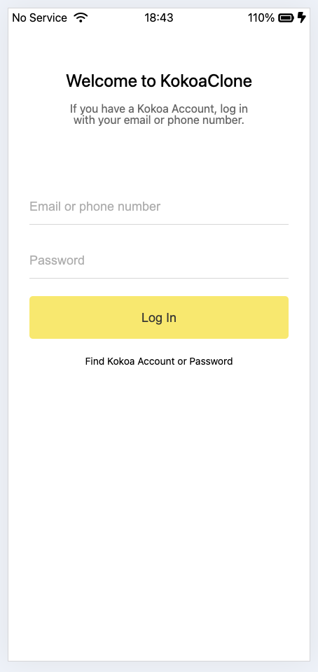
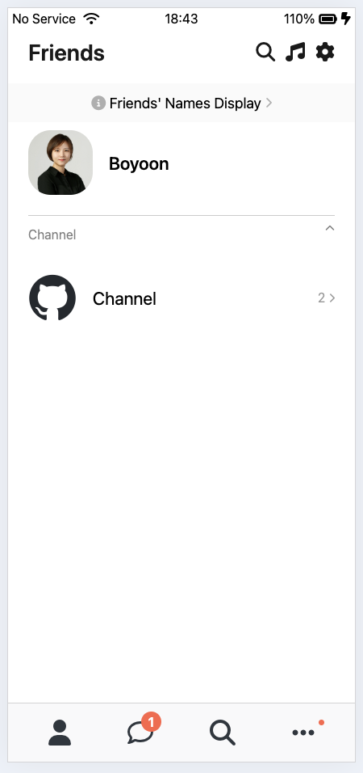
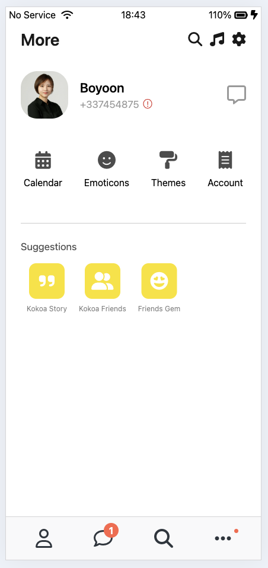
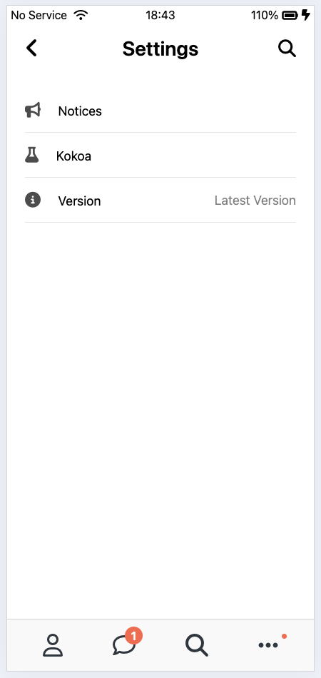

# Kokoa Clone 2025

This project is a static website built with HTML and CSS.  
Optimized for smartphone screens; layout issues may occur on larger screens.

    

        <h3>index.html</h3>
        
    

        

        <h3>friends.html</h3>
    
    

    

        <h3>chats.html</h3>
        
    

    

        <h3>find.html</h3>
        
    

    

        <h3>more.html</h3>
        
    

    

        <h3>settings.html</h3>
        
    

    

        <h3>chat.html</h3>
        
    

